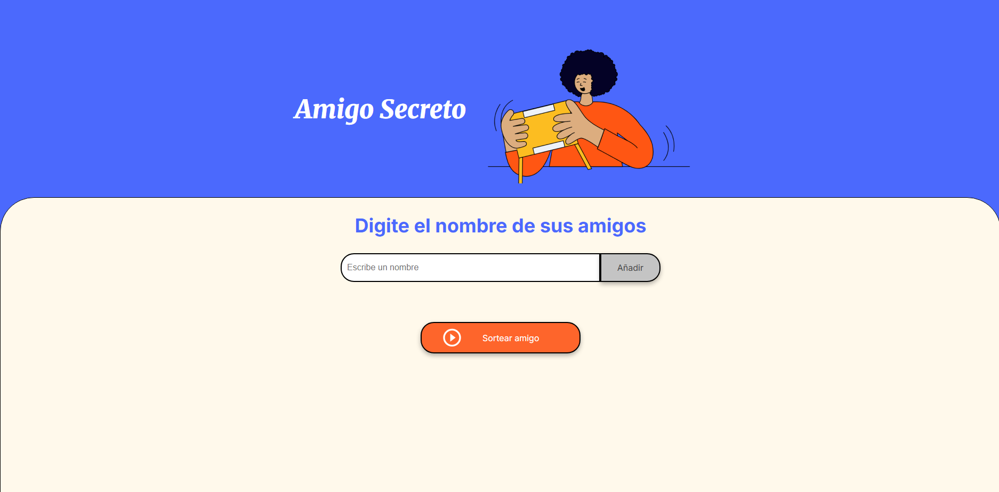
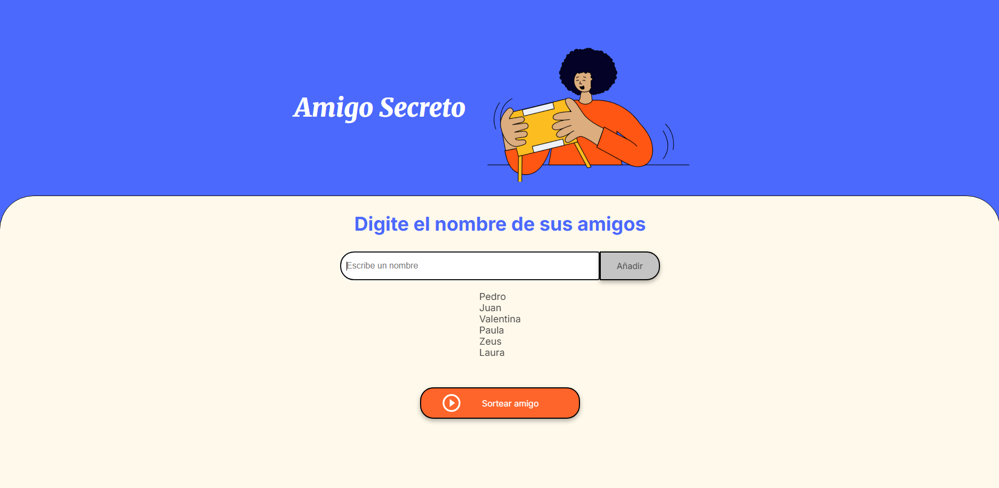
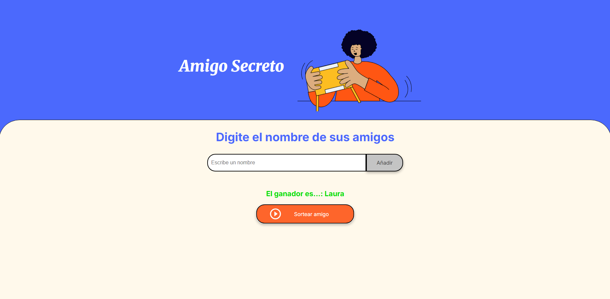
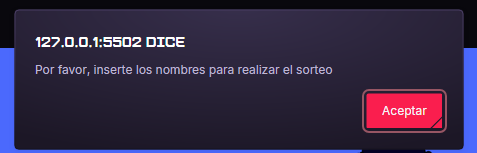

# Challenge-Amigo-Secreto
**Entrega del challenge amigo secreto de ONE and ALURA**

**Amigo Secreto** es una aplicación web interactiva que te permite organizar de manera practica y divertida el clásico juego de intercambio de regalos conocido como "Amigo Secreto". Con esta herramienta, podrás agregar los nombres de tus amigos y realizar un sorteo aleatorio para asignar a cada persona su amigo secreto.

## Funcionalidades 🚀
- 🚨 **Alerta cuando no hay amigos para sortear**: Si intentas sortear sin haber agregado nombres, recibirás un mensaje de advertencia que dice: "No hay amigos para sortear". Así, evitarás errores y asegurarás que el juego tenga participantes antes de iniciar. ❌🎲
- 🎉 **Alerta de sorteo completo**: ¡No más sorpresas inesperadas! Ahora, cuando todos los amigos hayan sido sorteados y la lista esté vacía, una alerta especial aparecerá en pantalla para informar al usuario que ya no quedan más nombres por sortear. Así, siempre sabrás cuándo el juego ha llegado a su fin. 🏁🎊
- ✏️ **Agregar nombres**: Permite a los usuarios ingresar el nombre de cada participante mediante un campo de texto y añadirlo a una lista.
- ⚠️ **Validación de entrada**: Si el campo de texto está vacío, la aplicación mostrará una alerta solicitando un nombre válido.
- 📜 **Visualizar la lista**: Los nombres ingresados se mostrarán en una lista visible en la página, permitiendo verificar quiénes participarán.
- 🎲 **Sorteo aleatorio**: Al hacer clic en el botón "Sortear Amigo", la aplicación seleccionará aleatoriamente un nombre de la lista y mostrará el resultado en pantalla.

## 🖼️ Capturas de Pantalla

1. **Pantalla Principal**: Interfaz inicial de la aplicación en el cual se agregan los nombres de los participantes del juego.

2. **Lista de Participantes**: Visualización de los nombres añadidos a la lista.

3. **Resultado del Sorteo**: Muestra el nombre del amigo secreto seleccionado.

4. **Fin del sorteo** Una vez hayan sido seleccionados todos los amigos, muestra el siguiente mensaje:

## 🛠️ Tecnologías Utilizadas

- **HTML5**: Estructura y contenido de la aplicación.
- **CSS3**: Estilos y diseño visual.
- **JavaScript**: Funcionalidad e interactividad.

## 💻 Uso

1. **Ingresa el nombre** de un participante en el campo de texto.
2. **Haz clic en "Adicionar"** para agregar el nombre a la lista.
3. Repite los pasos anteriores hasta que todos los participantes estén en la lista.
4. **Haz clic en "Sortear Amigo"** para realizar el sorteo y revelar el nombre del amigo secreto.